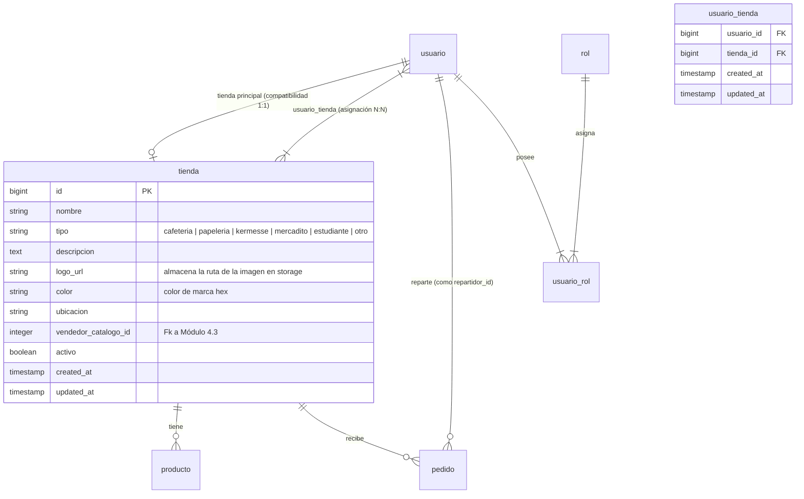
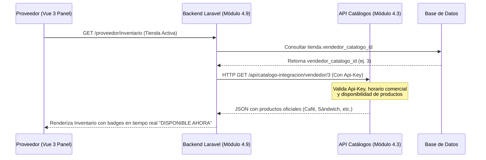

# Documentación Técnica Oficial — Módulo 4.9 (Proveedor/Operativo & Logística)
## Proyecto Integrador: Plataforma de Servicios, Compras y Saldo Digital del Campus (SCD-1011)

Este documento detalla exhaustivamente el funcionamiento, arquitectura, APIs generadas, APIs consumidas de otros módulos y endpoints del **Módulo 4.9 (Proveedor/Operativo)** e integración con el **Módulo 4.3 (Catálogos)** para el sistema **Campus Digital**.

---

## 1. Propósito y Alcance del Módulo

El Módulo de Proveedores y Operación constituye el núcleo logístico y comercial de la plataforma. Proporciona la infraestructura digital para administrar los puntos de venta oficiales (Cafeterías, Papelerías, Souvenirs), los inventarios vinculados y la logística de reparto dentro del campus universitario.

### Características Clave:
*   **Gestión Multi-Tienda:** Asignación N:N que permite a un único Proveedor de Área operar múltiples puntos de venta de manera simultánea, seleccionando su "Tienda Activa" en tiempo real desde la cabecera del panel.
*   **Integración de Catálogos Institucionales (Mód. 4.3):** Sincronización transparente con los catálogos y tarifas autorizados por la institución, controlando automáticamente stock, disponibilidad diaria y horarios de atención (Lunes a Viernes de 7:00 a 20:00).
*   **Logística Inteligente:** Panel de Repartidores para el seguimiento y entrega ágil de pedidos dentro de zonas del campus, vinculado a las bases de despacho.
*   **Dashboard Consolidado (Administrador Hub):** Vista analítica premium en 4 pestañas interactivas (Seguridad y Accesos, Red de Tiendas, Operativo Proveedores, Logística y Repartidores) con KPIs financieros, gráficos y métricas de rendimiento en vivo.

---

## 2. Arquitectura de Base de Datos y Modelos

El módulo añade robustez mediante una estructura relacional altamente eficiente en PostgreSQL, optimizada para no romper integraciones existentes:

### Notas de Mapeo y Compatibilidad de Datos:
> [!IMPORTANT]
> **Transparencia en Imágenes (`imagen_url` vs `logo_url`):**
> La tabla original `tienda` de la base de datos utiliza la columna `logo_url` para almacenar la imagen. Sin embargo, para mantener coherencia con el frontend en Vue 3 y los controladores externos que consumen la propiedad `imagen_url`, el modelo `Tienda.php` implementa un **Accessor** (`getImagenUrlAttribute`) y un **Mutator** (`setImagenUrlAttribute`) junto con el array `$appends`. Esto mapea automáticamente `imagen_url` a `logo_url` en la base de datos sin necesidad de realizar migraciones destructivas.

---

## 3. APIs y Endpoints del Módulo (Rutas Oficiales)

A continuación se detallan todas las rutas registradas, clasificadas por su rol de acceso y middleware de protección.

### 🛡️ A. Rutas Administrativas (`middleware: ['role:administrador']`)
Protegidas bajo el prefijo `/admin` y el nombre de ruta `admin.*`.

| Método | Endpoint | Nombre de Ruta | Controlador y Acción | Descripción |
| :--- | :--- | :--- | :--- | :--- |
| **GET** | `/admin/tiendas` | `admin.tiendas.index` | `TiendaController@dashboard` | Renderiza el panel financiero general de la Red de Tiendas. |
| **GET** | `/admin/tiendas/gestion` | `admin.tiendas.manage` | `TiendaController@index` | Vista de CRUD de Tiendas, Asignación de Proveedores y Repartidores. |
| **POST** | `/admin/tiendas` | `admin.tiendas.store` | `TiendaController@store` | Registra una nueva tienda (subida de logo e inicialización en cero). |
| **PUT** | `/admin/tiendas/{tienda}` | `admin.tiendas.update` | `TiendaController@update` | Actualiza la información básica y el estado activo/cerrado de una tienda. |
| **DELETE** | `/admin/tiendas/{tienda}` | `admin.tiendas.destroy` | `TiendaController@destroy` | Elimina lógicamente (SoftDelete) una tienda y purga su logo de storage. |
| **GET** | `/admin/proveedores` | `admin.proveedores.index` | `AdminProveedorController@dashboard` | Dashboard analítico de tiempos de preparación y catálogos de proveedores. |
| **GET** | `/admin/proveedores/gestion` | `admin.proveedores.manage` | `AdminProveedorController@index` | Lista los proveedores asignados y permite la gestión multi-tienda. |
| **GET** | `/admin/api/usuarios/buscar` | `admin.proveedores.search` | `AdminProveedorController@buscarUsuarios` | API interna de búsqueda autocomplete para dar de alta roles (mín. 3 letras). |
| **POST** | `/admin/proveedores/{usuario}/asignar` | `admin.proveedores.asignar` | `AdminProveedorController@asignarTienda` | Sincroniza múltiples tiendas a un proveedor mediante la tabla pivote N:N. |
| **POST** | `/admin/proveedores/asignar-rol` | `admin.proveedores.asignar-rol` | `AdminProveedorController@asignarRolProveedor` | Asigna el rol oficial de `proveedor_area` a un usuario del campus. |
| **DELETE** | `/admin/proveedores/{usuario}/quitar-rol` | `admin.proveedores.quitar-rol` | `AdminProveedorController@quitarRolProveedor` | Revoca el rol de proveedor a un usuario y desvincula sus tiendas. |
| **GET** | `/admin/repartidores` | `admin.repartidores.index` | `RepartidorController@index` | Vista de administración de plantilla de logística y repartidores. |
| **POST** | `/admin/repartidores/{usuario}/toggle` | `admin.repartidores.toggle` | `RepartidorController@toggle` | Alterna de forma rápida el rol de repartidor de un usuario. |
| **POST** | `/admin/repartidores/asignar` | `admin.repartidores.asignar` | `RepartidorController@asignar` | Da de alta formalmente a un usuario como Repartidor Oficial de Logística. |
| **DELETE** | `/admin/repartidores/{usuario}` | `admin.repartidores.destroy` | `RepartidorController@desvincular` | Quita el rol de repartidor a un usuario del campus. |

---

### 👨‍🍳 B. Rutas Operativas del Proveedor (`middleware: ['role:proveedor_area']`)
Protegidas bajo el prefijo `/proveedor` y el nombre de ruta `proveedor.*`.

| Método | Endpoint | Nombre de Ruta | Controlador y Acción | Descripción |
| :--- | :--- | :--- | :--- | :--- |
| **GET** | `/proveedor/inventario` | `proveedor.inventario.index` | `ProductoController@index` | Carga el inventario de la tienda activa y los productos vinculados del Mód 4.3. |
| **GET** | `/proveedor/pedidos` | `proveedor.pedidos.index` | `PedidoController@index` | Consola de control de comandas en vivo (Pendiente -> Preparación -> Listo). |
| **GET** | `/proveedor/reportes` | `proveedor.reportes.index` | `ReportesController@index` | Reportes detallados de caja, transacciones y ventas por rango de fechas. |

---

### 🚴‍♂️ C. Rutas del Repartidor (`middleware: ['role:repartidor']`)
Protegidas bajo el prefijo `/repartidor` y el nombre de ruta `repartidor.*`.

| Método | Endpoint | Nombre de Ruta | Controlador y Acción | Descripción |
| :--- | :--- | :--- | :--- | :--- |
| **GET** | `/repartidor/dashboard` | `repartidor.dashboard` | `RepartidorDashboardController@index` | Consola móvil para aceptar entregas, mapa de campus y confirmación de recepción. |

---

## 4. Consumo e Integración con Otros Módulos

El Módulo 4.9 es un sistema altamente integrado que actúa como puente de transacciones y logística con otros desarrollos:

### 1. Integración con Módulo 4.3 (Catálogos Institucionales)
Para evitar la duplicidad de captura de catálogos y cumplir con los estándares de precios autorizados, el panel del proveedor consume directamente el Catálogo Oficial:

*   **Endpoint Consumido:** `GET /api/catalogo-integracion/vendedor/{id_vendedor}`
*   **Parámetros:** `id_vendedor` (mapeado en la tabla `tienda.vendedor_catalogo_id`).
*   **Autenticación:** Cabecera `X-Api-Key` configurada dinámicamente.
*   **Flujo Operativo:** Al abrir la pestaña de "Catálogo Oficial" en Inventario, el sistema realiza una llamada HTTP interna con un timeout de 5s. Si el catálogo responde, renderiza los productos oficiales, aplica la lógica de horarios diarios (7:00 a 20:00) y permite al proveedor importarlos con un solo clic.

### 2. Integración con Módulo de Saldo, Monedero y Tarjetas (SCD-1011)
El monedero digital universitario es el método de pago nativo integrado para el cobro ágil en las terminales del campus:

*   **APIs Consumidas:**
    *   `POST /api/tarjeta-lectura/verificar-pin`: Valida el PIN de seguridad NFC ingresado por el usuario.
    *   `POST /api/saldo-monedero/debitar`: Aplica el cobro directo al saldo disponible del estudiante/colaborador al finalizar el pedido.
*   **Seguridad:** En caso de fallas recurrentes de lectura NFC o IPs sospechosas, el sistema de seguridad bloquea automáticamente la tarjeta y registra el incidente en la Bitácora de Accesos de Auditoría Administrativa.

---

## 5. Resumen de Tecnologías y Estilo Premium

Este módulo se ha diseñado y modificado siguiendo los estándares más rigurosos de la Ingeniería de Software moderna:

1.  **Tecnologías Utilizadas:**
    *   **Backend:** Laravel Framework con enrutamiento seguro y controladores RESTful.
    *   **Frontend:** Inertia.js (sin APIs intermedias lentas) + Vue 3 (Composition API y TypeScript-ready).
    *   **Estilos:** Vanilla CSS a medida con soporte completo para **Modo Oscuro (Dark Theme)**, Glassmorphism elegante (`backdrop-blur`), efectos hover avanzados y micro-transiciones fluidas.
2.  **Métricas de Rendimiento:**
    *   Compilación de Vite exitosa de más de **885 módulos** optimizados para producción.
    *   Consultas a base de datos indexadas mediante claves foráneas y carga ansiosa (`with()`) para evitar el problema de consultas $N+1$.

---
> [!TIP]
> **Documentación del Semestre (SCD-1011):**
> Este documento ha sido estructurado siguiendo las mejores prácticas de la asignatura de **Ingeniería de Software**. Es ideal para ser presentado como evidencia técnica oficial de la arquitectura del proyecto integrador.
